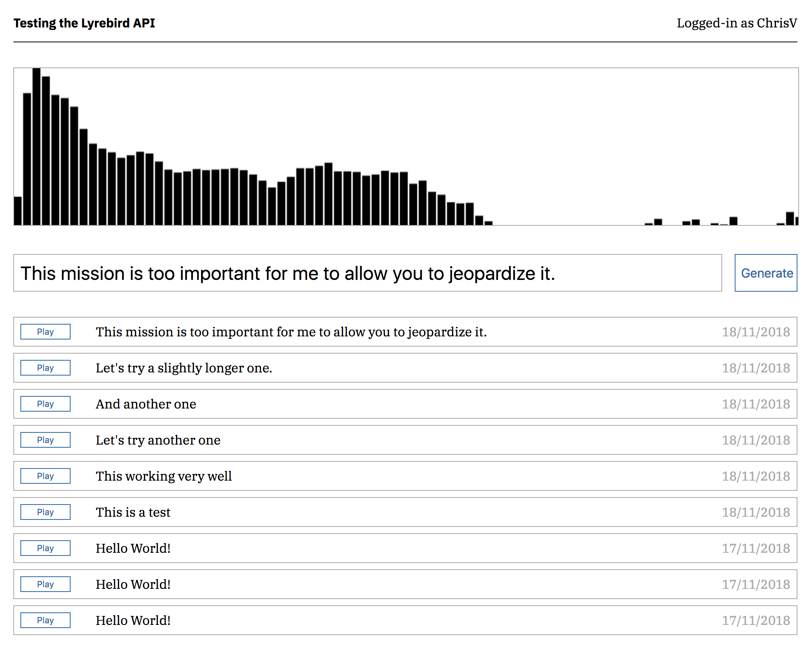

## Lyrebird API test app

I had fun trying Lyrebird to train my own artificial voice and generating some text-to-speech with it. To run this prototype, follow the [Lyrebird documentation](https://docs.lyrebird.ai/) and get your application key. Then clone this repo and run: 

`npm run setup`  

Then replace `YOUR_CLIENT_ID` by your Lyrebird Application key:  

`CLIENT_ID=YOUR_CLIENT_ID npm start`
